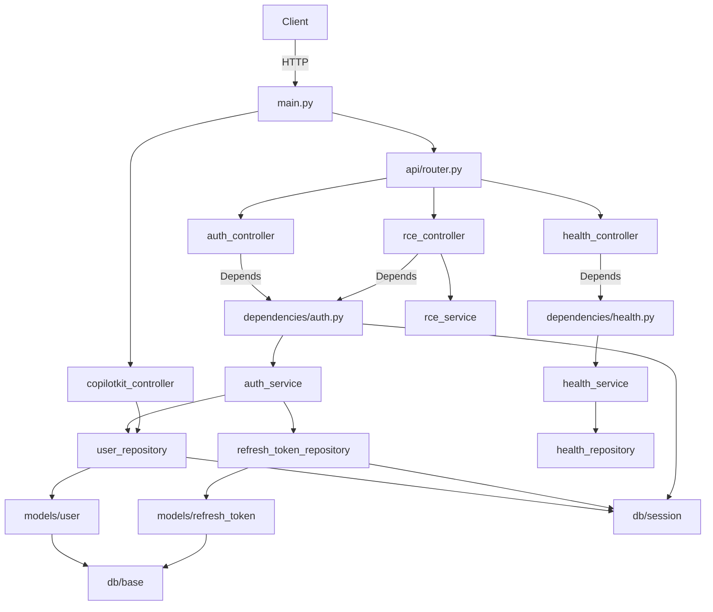

# Project Hannibal — Backend Overview

FastAPI + SQLAlchemy + PostgreSQL backend. JWT auth (HttpOnly cookies), Google OAuth, and a CopilotKit AI chat agent powered by Google ADK + Gemini 2.5 Flash.

## Architecture

## Layer Map

| Layer | Folder | Purpose |
|---|---|---|
| Entry | [[app/_app]] | App factory + middleware |
| Routing | [[app/api/_api]] | URL prefix wiring |
| Controllers | [[app/api/v1/controllers/_controllers]] | HTTP handlers — thin, delegate to services |
| Services | [[app/services/_services]] | Business logic |
| Repositories | [[app/repositories/_repositories]] | DB access only |
| Models | [[app/models/_models]] | SQLAlchemy ORM table definitions |
| Schemas | [[app/schemas/_schemas]] | Pydantic request/response shapes |
| Dependencies | [[app/dependencies/_dependencies]] | FastAPI DI wiring |
| Config | [[app/core/_core]] | Settings + logging |
| DB | [[app/db/_db]] | Engine + session factory |

## All Files

### Entry
- [[app/main]] — App factory, middleware, CopilotKit wiring

### API
- [[app/api/router]] — Assembles all route prefixes

### Controllers
- [[app/api/v1/controllers/auth_controller]] — Auth endpoints (register, login, logout, refresh, Google OAuth)
- [[app/api/v1/controllers/health_controller]] — Health check endpoint
- [[app/api/v1/controllers/copilotkit_controller]] — CopilotKit SSE streaming + ADK agent
- [[app/api/v1/controllers/rce_controller]] — `POST /rce/execute` sandboxed code execution

### Services
- [[app/services/auth_service]] — Auth business logic (tokens, bcrypt, OAuth)
- [[app/services/health_service]] — Health status assembly
- [[app/services/rce_service]] — Sandboxed Docker execution for Python and JavaScript

### Repositories
- [[app/repositories/user_repository]] — User DB queries
- [[app/repositories/refresh_token_repository]] — Refresh token DB queries
- [[app/repositories/health_repository]] — Health status (no-DB stub)
- [[app/repositories/base]] — Repository protocol definition

### Models
- [[app/models/user]] — `users` table ORM model
- [[app/models/refresh_token]] — `refresh_tokens` table ORM model

### Schemas
- [[app/schemas/auth]] — Auth request/response Pydantic models
- [[app/schemas/health]] — Health Pydantic models
- [[app/schemas/rce]] — `ExecuteRequest`, `ExecuteResponse`

### Dependencies
- [[app/dependencies/auth]] — Provides `AuthService`, `require_auth` guard
- [[app/dependencies/health]] — Provides `HealthService`

### Core
- [[app/core/config]] — `Settings` dataclass, reads `.env`
- [[app/core/logging]] — Logging format setup

### DB
- [[app/db/session]] — SQLAlchemy engine + `SessionLocal`
- [[app/db/base]] — `DeclarativeBase` for all ORM models
