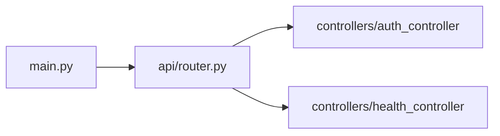

# `app/api/`

Contains the routing layer. All HTTP routes are assembled here and included into `main.py`.

## Sub-folders

- [[app/api/v1/_v1]] — Versioned API (`v1`) with controllers

## Files

- [[app/api/router]] — Combines auth and health routers under `/api/v1`
