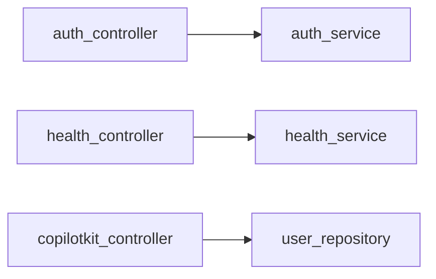

# `app/api/v1/controllers/`

Each controller file owns one logical domain. Controllers are intentionally thin — they parse HTTP input, delegate to the service layer, and shape the HTTP response (cookies, status codes, redirects). No business logic lives here.

## Files

- [[app/api/v1/controllers/auth_controller]] — Register, login, logout, token refresh, Google OAuth
- [[app/api/v1/controllers/health_controller]] — `GET /health` liveness probe
- [[app/api/v1/controllers/copilotkit_controller]] — CopilotKit SSE endpoint + Google ADK agent
