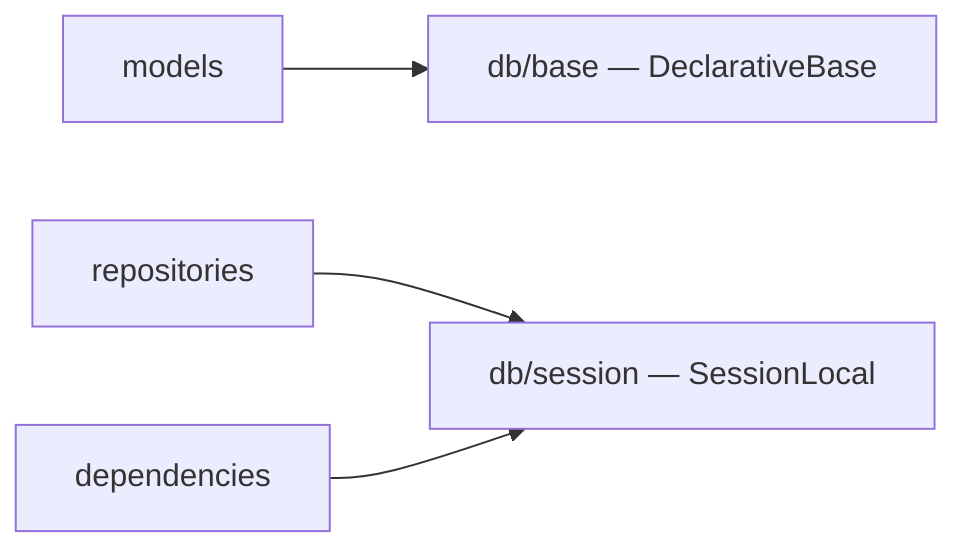

# `app/db/`

Database infrastructure — two small files that all ORM models and repositories depend on.

## Files

- [[app/db/base]] — `Base` — `DeclarativeBase` that all ORM model classes inherit from
- [[app/db/session]] — SQLAlchemy `engine` and `SessionLocal` factory
