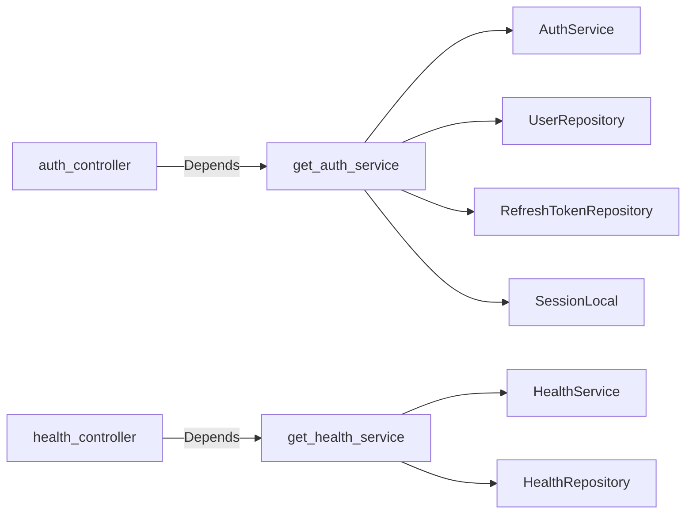

# `app/dependencies/`

FastAPI's `Depends()` system is wired here. Each function in this folder is a **provider** — FastAPI calls it for every request and injects the result into route handler parameters.

This is where the service and repository layers get assembled with their DB sessions.

## Files

- [[app/dependencies/auth]] — `get_db`, `get_auth_service`, `require_auth`
- [[app/dependencies/health]] — `get_health_service`
