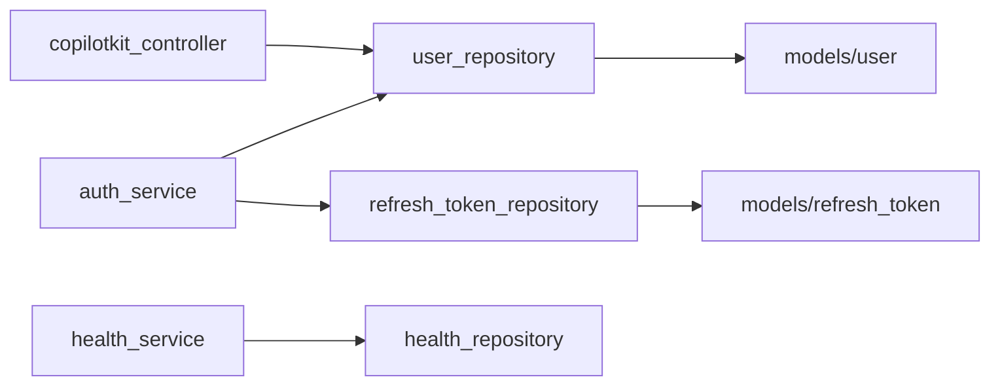

# `app/repositories/`

The data access layer. Each repository owns queries for one table or domain. No business rules here — just DB reads and writes via SQLAlchemy sessions.

## Files

- [[app/repositories/user_repository]] — CRUD + OAuth upsert for the `users` table
- [[app/repositories/refresh_token_repository]] — Create, lookup, and revoke refresh tokens
- [[app/repositories/health_repository]] — No-DB health payload (stub)
- [[app/repositories/base]] — `Repository` protocol (structural typing contract)
