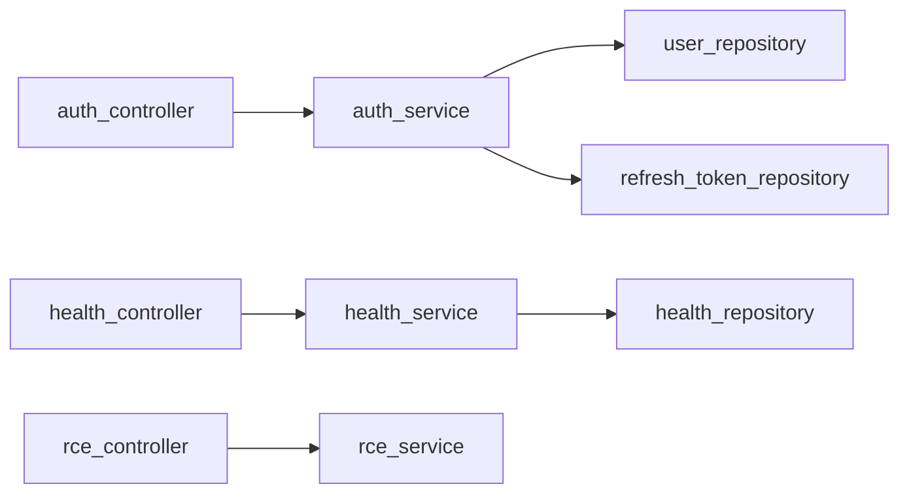

# `app/services/`

The business logic layer. Services own all domain rules: token creation, password hashing, OAuth flow, validation. Controllers call services; services call repositories — never skip layers.

## Files

- [[app/services/auth_service]] — Auth logic: register, login, logout, JWT creation, Google OAuth
- [[app/services/health_service]] — Assembles the health status response
- [[app/services/rce_service]] — Sandboxed Docker execution for Python and JavaScript
