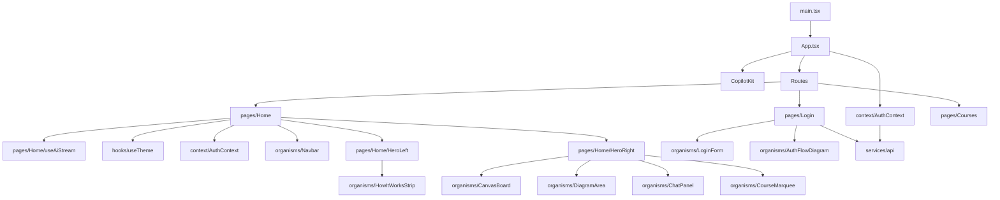

# Project Hannibal — Frontend Overview

React 19 + TypeScript + Vite. CSS Modules only (no Tailwind). React Router v6 for routing. CopilotKit for AI chat. Auth via HttpOnly cookies (no local storage).

## Architecture



## Component Hierarchy (Atomic Design)

```
Atoms       → primitive, stateless UI bricks
Molecules   → atoms composed into patterns
Organisms   → full UI sections, may have local state
Pages       → assemble organisms, own routing and data
```

## Layer Map

| Layer | Path | Purpose |
|---|---|---|
| Entry | [[frontend/src/_src]] | Vite entry + App shell |
| Pages | [[frontend/src/pages/_pages]] | Full routes — Home, Login, Storyboard |
| Context | [[frontend/src/context/_context]] | Global React state (auth, user) |
| Hooks | [[frontend/src/hooks/_hooks]] | Reusable stateful logic |
| Services | [[frontend/src/services/_services]] | All API calls |
| Organisms | [[frontend/src/shared/components/organisms/_organisms]] | Full UI sections |
| Molecules | [[frontend/src/shared/components/molecules/_molecules]] | Composed component patterns |
| Atoms | [[frontend/src/shared/components/atoms/_atoms]] | Primitive UI building blocks |
| Types | [[frontend/src/shared/types/types]] | All shared TypeScript types |
| Styles | [[frontend/src/styles/_styles]] | Design tokens + global CSS |

## All Files

### Entry
- [[frontend/src/main]] — Vite entry, mounts App, loads global CSS
- [[frontend/src/App]] — Router + AuthProvider + CopilotKit tree

### Pages
- [[frontend/src/pages/Home/Home]] — Home page (AI tutor + diagram canvas)
- [[frontend/src/pages/Home/HeroLeft]] — Left column: headline, CTAs, HowItWorks
- [[frontend/src/pages/Home/HeroRight]] — Right column: CanvasBoard + AI chat + agent tasks
- [[frontend/src/pages/Home/useAiStream]] — Demo chat streaming animation hook
- [[frontend/src/pages/Login/Login]] — Login/register page with Google OAuth
- [[frontend/src/pages/Courses/Courses]] — Courses catalogue: filter chips, AI prompt bar, learning path, featured grid, AI recommendations
- [[frontend/src/pages/Storyboard/Storyboard]] — Internal component library browser (not routed)

### Context & Hooks
- [[frontend/src/context/AuthContext]] — `AuthProvider` + `useAuth` hook — user state + logout
- [[frontend/src/hooks/useTheme]] — Theme toggle hook (light/dark)

### Services
- [[frontend/src/services/api]] — Fetch wrapper with cookie auth + auto token refresh

### Shared Types
- [[frontend/src/shared/types/types]] — All TypeScript interfaces and types

### Organisms
- [[frontend/src/shared/components/organisms/Navbar]] — Top navigation bar
- [[frontend/src/shared/components/organisms/LoginForm]] — Email/password + OAuth login form
- [[frontend/src/shared/components/organisms/AuthFlowDiagram]] — Static swimlane auth diagram
- [[frontend/src/shared/components/organisms/CanvasBoard]] — Outer shell for diagram + chat
- [[frontend/src/shared/components/organisms/DiagramArea]] — Draggable nodes + SVG edge routing
- [[frontend/src/shared/components/organisms/ChatPanel]] — Chat stream + input row
- [[frontend/src/shared/components/organisms/HowItWorksStrip]] — 3-step process strip
- [[frontend/src/shared/components/organisms/CourseMarquee]] — Scrolling course chip ticker
- [[frontend/src/shared/components/organisms/LearningPath]] — Horizontal scrollable step path (complete/current/upcoming states)
- [[frontend/src/shared/components/molecules/CourseCard]] — Course card with illustration, level badge, stack tags — or genUI placeholder

### Molecules
- [[frontend/src/shared/components/molecules/_molecules]]

### Atoms
- [[frontend/src/shared/components/atoms/_atoms]]
