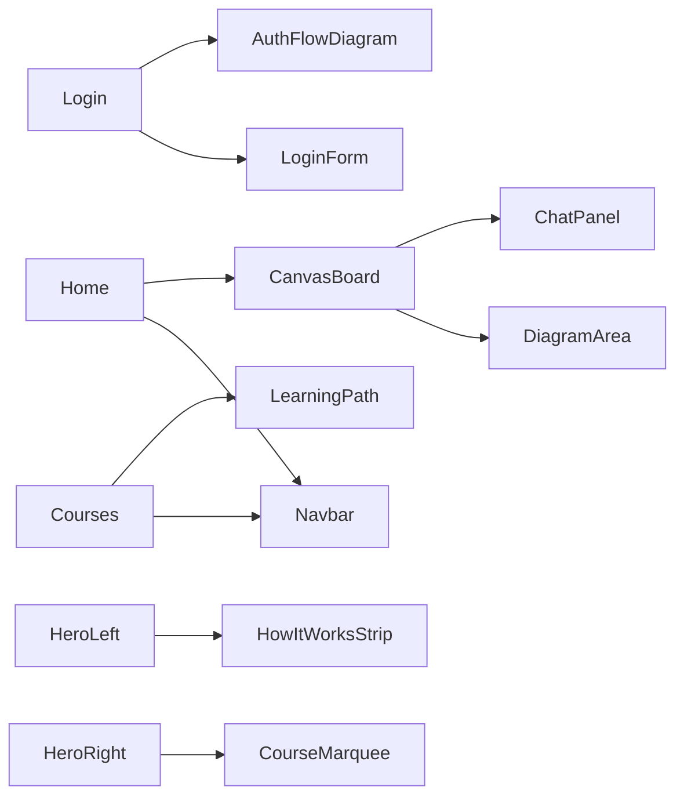

# `src/shared/components/organisms/`

Organisms are the largest reusable components. Each one is a self-contained UI section — a form, a navbar, a diagram canvas. They can hold local state but don't fetch data.

## Files

- [[frontend/src/shared/components/organisms/Navbar]] — Top navigation bar (links, theme toggle, logout)
- [[frontend/src/shared/components/organisms/LoginForm]] — Email/password form + OAuth buttons
- [[frontend/src/shared/components/organisms/AuthFlowDiagram]] — Static auth swimlane diagram shown on Login
- [[frontend/src/shared/components/organisms/CanvasBoard]] — Shell for the diagram + chat panel
- [[frontend/src/shared/components/organisms/DiagramArea]] — Draggable nodes + SVG edge routing
- [[frontend/src/shared/components/organisms/ChatPanel]] — Chat message stream + input row
- [[frontend/src/shared/components/organisms/HowItWorksStrip]] — 3-step how-it-works process
- [[frontend/src/shared/components/organisms/CourseMarquee]] — Scrolling course chip ticker
- [[frontend/src/shared/components/organisms/LearningPath]] — Horizontal scrollable step path with complete/current/upcoming states
